# Kubernetes Microservices Deployment on AWS EC2

Deployed a 3-service Java microservices application onto a Kubernetes cluster running on AWS EC2 using Minikube. Each service was independently built, containerised, and deployed — with live REST API endpoints verified and workloads monitored through the Kubernetes Dashboard.

---

## Architecture

```
GitHub Source Code
        │
        ▼
Maven Build (x3 services)
        │
        ▼
Docker Image Build → DockerHub (miihirxtc/*)
        │
        ▼
Kubernetes (Minikube on AWS EC2 — Amazon Linux)
        │
        ├── Pod: shopfront        (NodePort 8010 → 8080)
        ├── Pod: productcatalogue (NodePort 8020 → 8090)
        └── Pod: stockmanager     (NodePort 8030 → 9008)
                │
                ▼
        Live REST API Endpoints
        kubectl Dashboard (port 8001)
```

---

## Tech Stack

| Layer | Tools |
|---|---|
| Container Orchestration | Kubernetes (Minikube v1.38.1) |
| Cloud Infrastructure | AWS EC2 — Amazon Linux, us-east-1 |
| Containerisation | Docker |
| Build Tool | Maven |
| Image Registry | DockerHub |
| CLI | kubectl |
| Manifest Format | YAML |

---

## Services Deployed

| Service | Docker Image | NodePort | Endpoint |
|---|---|---|---|
| Shopfront | `miihirxtc/shopfront:latest` | 8010 | `/` |
| Product Catalogue | `miihirxtc/productcatalogue:latest` | 8020 | `/products` |
| Stock Manager | `miihirxtc/stockmanager:latest` | 8030 | `/stocks` |

---

## Cluster State

All three services running as confirmed by `kubectl get pods`:

```
NAME                                READY   STATUS    RESTARTS   AGE
productcatalogue-796cf9b8c7-rz2pt   1/1     Running   0          33m
shopfront-96d975bf5-25wrn           1/1     Running   0          33m
stockmanager-7b6cf5cdc7-ws2bw       0/1     Running   13         33m
```

Services exposed via NodePort (`kubectl get svc`):

```
NAME               TYPE        CLUSTER-IP       PORT(S)
productcatalogue   NodePort    10.110.65.19     8020:30833/TCP
shopfront          NodePort    10.97.107.163    8010:31622/TCP
stockmanager       NodePort    10.101.250.156   8030:31204/TCP
```

---

## Live API Responses

### GET `/products` — Product Catalogue Service
```json
[
  { "id": "1", "name": "Widget",    "description": "Premium ACME Widgets", "price": 1.2   },
  { "id": "2", "name": "Sprocket",  "description": "Grade B sprockets",    "price": 4.1   },
  { "id": "3", "name": "Anvil",     "description": "Large Anvils",         "price": 45.5  },
  { "id": "4", "name": "Cogs",      "description": "Grade Y cogs",         "price": 1.8   },
  { "id": "5", "name": "Multitool", "description": "Multitools",           "price": 154.1 }
]
```

### GET `/stocks` — Stock Manager Service
```json
[
  { "productId": "1", "sku": "12345678", "amountAvailable": 5   },
  { "productId": "2", "sku": "34567890", "amountAvailable": 2   },
  { "productId": "3", "sku": "54326745", "amountAvailable": 999 },
  { "productId": "4", "sku": "93847614", "amountAvailable": 0   },
  { "productId": "5", "sku": "11856388", "amountAvailable": 1   }
]
```

---

## Pod Health Configuration

Each pod configured with Liveness Probes for automatic health monitoring:

| Setting | Value |
|---|---|
| Initial Delay | 30 seconds |
| Probe Period | 10 seconds |
| Timeout | 1 second |
| Failure Threshold | 3 |

Health check endpoints:
- Shopfront: `http://[host]:8010/health`
- Product Catalogue: `http://[host]:8025/healthcheck`
- Stock Manager: `http://[host]:8030/health`

---

## DockerHub Images

All three images published publicly under `miihirxtc` namespace:

| Repository | Pushed |
|---|---|
| `miihirxtc/shopfront` | ✓ |
| `miihirxtc/productcatalogue` | ✓ |
| `miihirxtc/stockmanager` | ✓ |

---

## Setup Steps

**1. Launch EC2 — Amazon Linux, us-east-1**

**2. Install dependencies**
```bash
yum update -y
yum install docker git java -y
systemctl start docker && systemctl enable docker
yum install conntrack -y
```

**3. Install Minikube**
```bash
curl -LO https://storage.googleapis.com/minikube/releases/latest/minikube-linux-amd64
sudo install minikube-linux-amd64 /usr/local/bin/minikube
/usr/local/bin/minikube start --force --driver=docker
```

**4. Install kubectl**
```bash
curl -o kubectl https://amazon-eks.s3.us-west-2.amazonaws.com/1.20.4/2021-04-12/bin/linux/amd64/kubectl
chmod +x ./kubectl && mkdir -p $HOME/bin
cp ./kubectl $HOME/bin/kubectl
export PATH=$HOME/bin:$PATH
```

**5. Build and push each service**
```bash
# Repeat for shopfront / productcatalogue / stockmanager
cd <service>/
mvn clean install -DskipTests
docker build -t <dockerhub-id>/<service>:latest .
docker push <dockerhub-id>/<service>:latest
```

**6. Deploy to Kubernetes**
```bash
cd kubernetes/
kubectl apply -f shopfront-service.yaml
kubectl apply -f productcatalogue-service.yaml
kubectl apply -f stockmanager-service.yaml
kubectl get pods
```

**7. Access Kubernetes Dashboard**
```bash
# Terminal 1
/usr/local/bin/minikube dashboard

# Terminal 2
kubectl proxy --address='0.0.0.0' --accept-hosts='^*$'
```

**8. Port-forward services for browser access**
```bash
kubectl port-forward --address 0.0.0.0 svc/shopfront 8080:8010
kubectl port-forward --address 0.0.0.0 svc/productcatalogue 8090:8020
kubectl port-forward --address 0.0.0.0 svc/stockmanager 9008:8030
```

---

## Screenshots

### Architecture
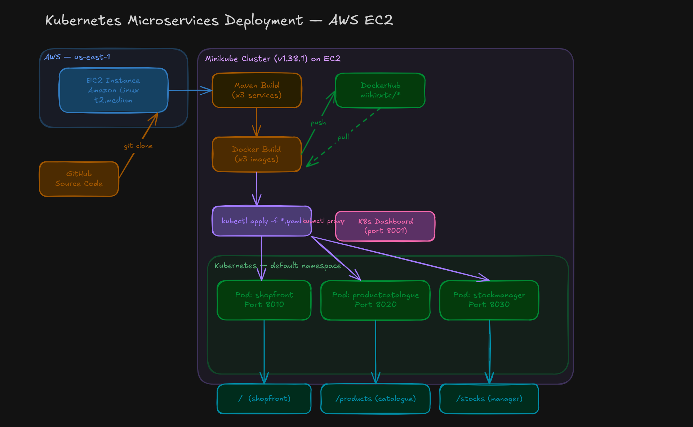

### Minikube Cluster Startup on EC2
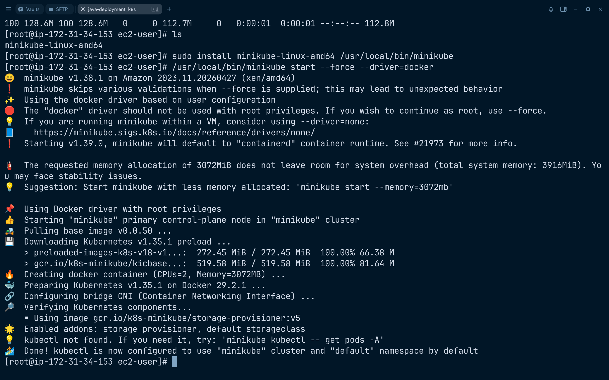

### Kubernetes Dashboard — Deployments (All Green)
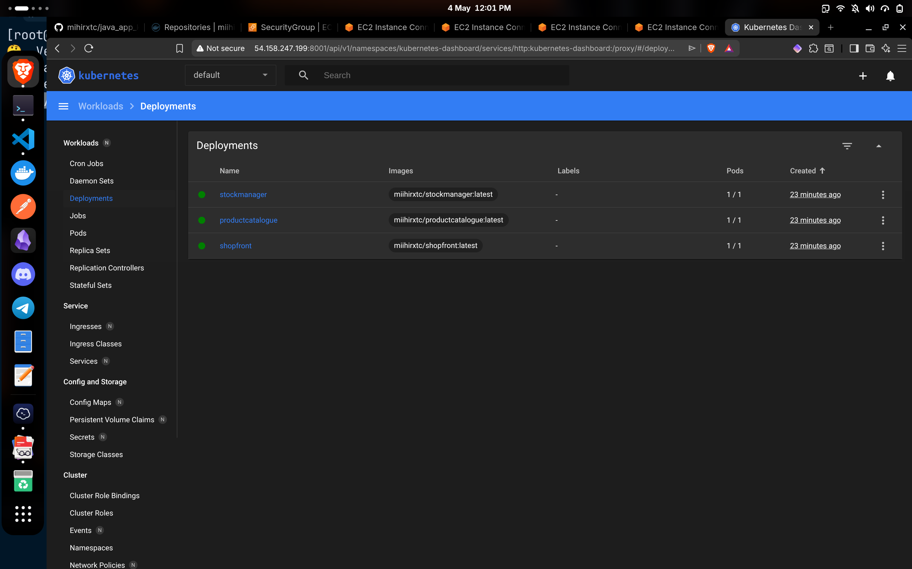

### Kubernetes Dashboard — Pods Running
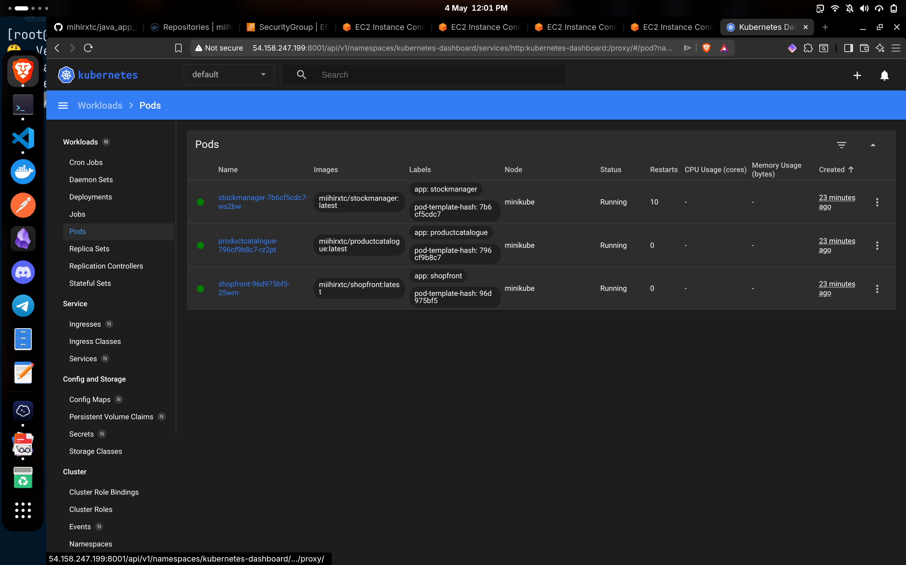

### Pod Detail — Stock Manager
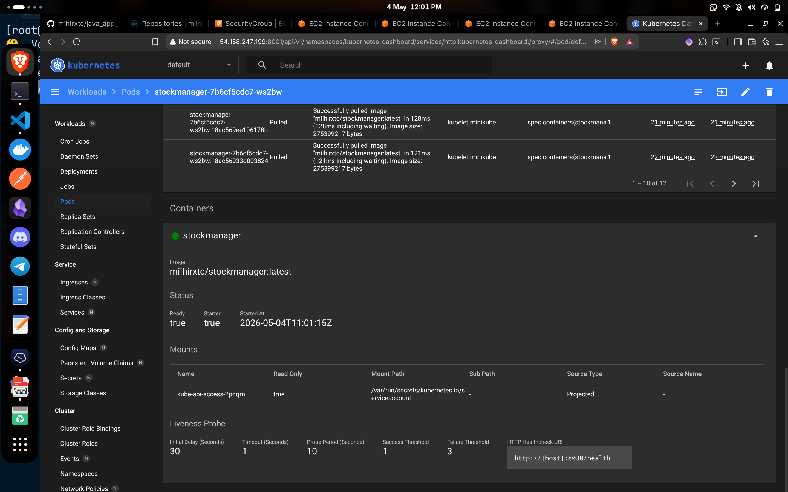

### Pod Detail — Product Catalogue
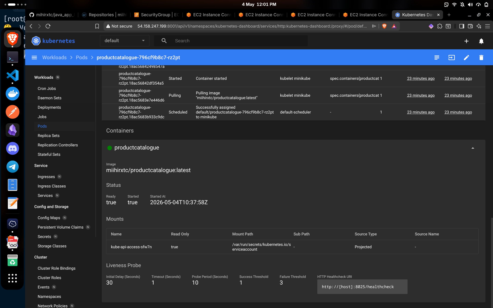

### Pod Detail — Shopfront
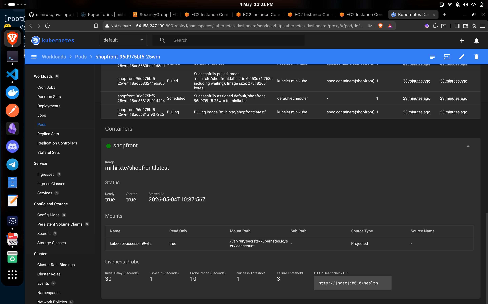

### Live API — /products Endpoint
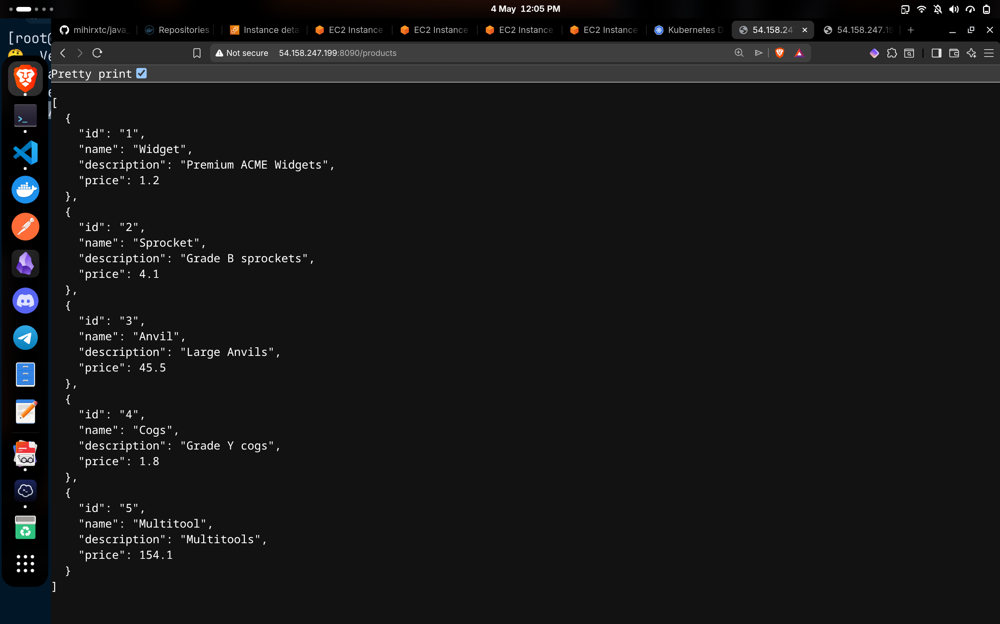

### Live API — /stocks Endpoint
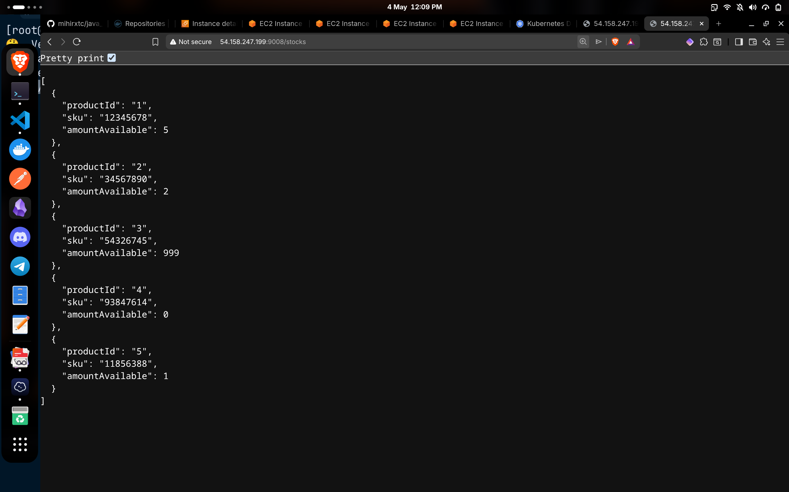

### kubectl get pods + get svc + docker images
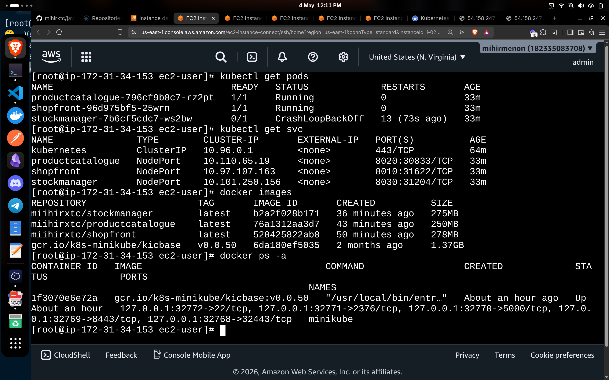

### DockerHub — All 3 Images Published
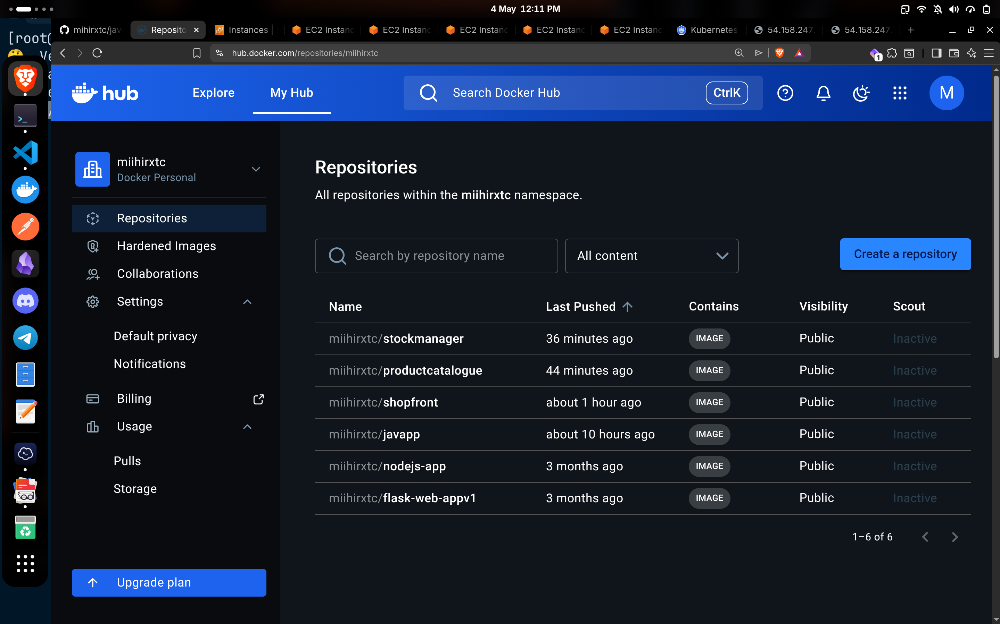

---

## Author

**mihirxtc**